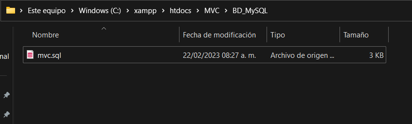

# CRUD CON MVC

- By Elgusano69

## ¿Que Funcion tiene este proyecto?


Este proyecto es un sencillo CRUD, es decir realiza las 4 funciones para la manipulación de los datos las cuales son insertar, leer, actualizar y eliminar o en ingles Create, Read, Update, Delete, el cual utiliza el patrón de la arquitectura MVC para de esta forma tener nuestro código dividido de una mejor forma. El fin de este mismo es el demostrar la utilización del patrón MVC.

## Requisitos que se deben de tener para poder instalar o utilzar el proyecto de forma local
Para poder utilizar este proyecto en cualquier computadora necesitaremos ciertos requisitos para que puede ejecutarse de una forma adecuada en cualquier computadora o laptop.

- Tener instalado un servidor local (XAMPP fue el utilizado en la creación del proyecto por lo que se recomienda utilizarlo).

- Descargar el repositorio de github en .zip para instalarlo de forma local.

- Descargar la base de datos que esta incluida en el repositorio de github ( en la carpeta ```BD_MySQL```).


### Instalación del proyecto de forma local

- Lo primero que vamos a hacer es descsrgar el rupositorio donde tenemos los archivos que necesitamos


- Luego de descargar el archivo .zip nos vamos a dirigir a la carpeta ```C:\xampp\htdocs``` para hacer lo siguiente


- Al traer los archivos .zip a ```C:\xampp\htdocs``` donde vamos a descomprimir la carpeta .zip para que al descomprimirla, tener todos los archivos que tenemos e el rupositorio


- Ya al descomprimirla nos daremos cuenta que estara la carpeta ```MVC```  donde vendran los arxhivos que vamos a necesitar


- Nos vamos a asegurar que todos los archivos que etaban en el repusitorio esten en esa carpeta


- Una vez que ya hemos realizado lo anterior correctamente, sera hora de ejecitar el XAMPP, abriremos la aplicacion y se abrira la interfaz y al mostrarse esa activaremos la opcion "Apache" "MySQL"


- Ya al activar los modulos de "Apache" "MySQL" en la parte de "MySQL" activaremos la opcion "admin" para que este nos lleve al localhost de phpmyadmin para realizar los siguientes pasos


- Al estar dentro de phpMyAdmin crearemos una base de datos "De preferncia que se llame igual a ñla que vienen en el archivo .zip"


- Ya al crear la base de datos pos solo tendriamos que importar la base de datos que tenemos en nueestro archivo y nos dirigiremos a ```C:\xampp\htdocs\MVC``` y nos vamos a la carpeta de ```BD_MySQL``` 


- Dentro de esa carpeta encontraremos el archivo sql que nos generara nuestra base de datos.


- Nos vzmos nuevamente a la base de datos que habíamos creado llamada ```mvc.sql``` en phpMyAdmin y le daremos click en el apartado de importar y subiremos el archivo sql.


- Ahora al importar correctamente nuestro archivo .sql ahora solo iremos hasta la parte de abajo donde lo importaremos


- A la hora de importar la base de datos que teniamos y al aparacer los siguientes mensajes en verde y diga que se importo con exito eso quiere decir que la importacion de nueestra base de datos fue todo un exito


- Por ahoraya terminamos toda la configuración del proyecto, ahora nos iremos a la barra del buscador y escribiremos ```localhost/CRUD-MVC/``` y nos abrirá nuestro proyecto completamente funcionando.


## Funcionamiento del CRUD

Ahora veremos la funcionalidad del CRUD, la cual no es de mucha complicacion pues veremos las funcionalidades basicas de esta que serian (Registro, Busqueda, Modificacion y Eliminacion)  

### Creación de la CATEGORIA
Para la creacion de alguna categoria en el proyecto solo tendriamos que rellenar los cuadros de texto los cuales se van a insertar en la base de datos para que al final se muestre en la tabla.


### Búsqueda de la CATEGORIA
Para buscar la categoria que tengamos insertada y se muestre sola en la tabla, solo tendremos que poner el nombre en la barra de busqueda i oprimir "Buscar" y op


### Modificación de la CATEGORIA
Al momento de querer cambiar algún producto nos dirigiremos al listado de los productos, una vez que veamos el producto que queramos modificar, daremos click a el botón de modificar que es amarillo.


Ahora al momento de dar click en modificar nos rellenara nuestro formulario de producto, haremos los cambios y daremos click en guardar.


Y ahora si nos dirigimos al listado de productos podremos ver que se han realizado los cambios.


### Eliminación de la CATEGORIA
Para la eliminación de un producto es muy sencillo, pues lo único que debemos de hacer es ir hacia el listado de productos, dar click en el botón de eliminar y se nos mostrara un alerta de si deseamos eliminar el producto, si damos click a confirmar aceptar eliminara el registro y si lo cancelamos no se afectara nada en el archivo, al dar click el registro del producto quedara eliminado tanto del listado como de la base de datos.


Y como podemos observar se eliminara nuestro registro de tanto del listado como de la base de datos.


